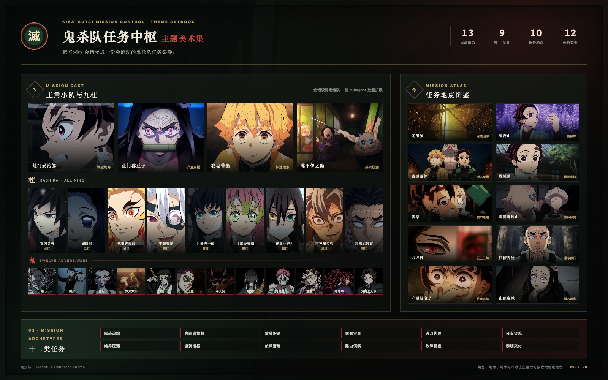
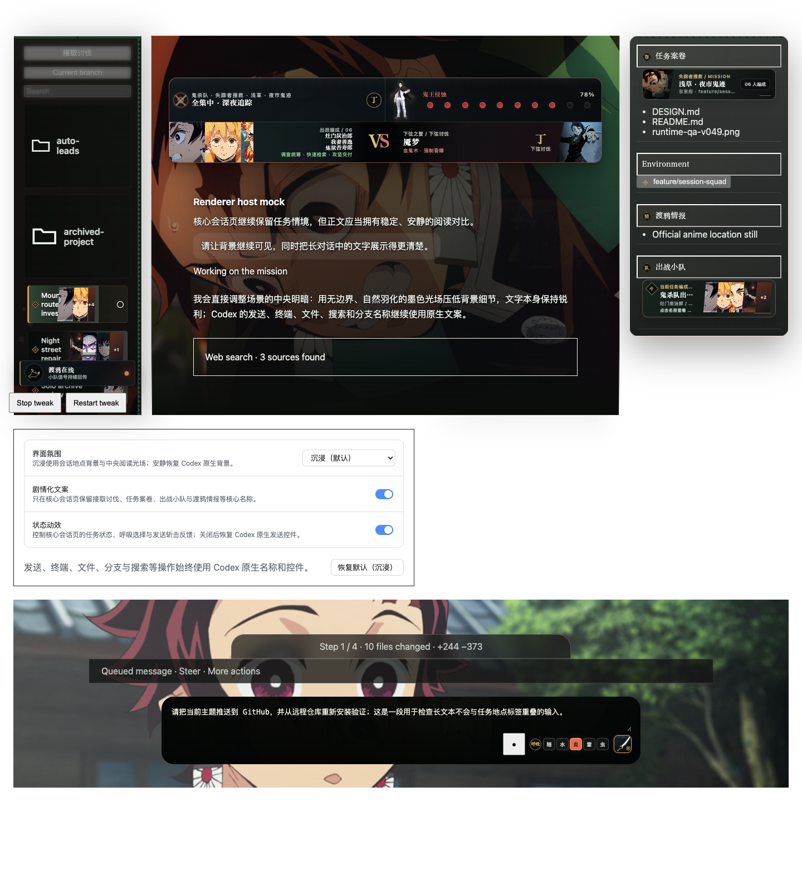
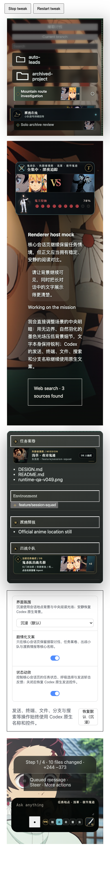

# 鬼灭之刃 Codex 主题 · 鬼杀队任务中枢

把 Codex 会话变成鬼杀队任务案卷：角色编队、任务地点、对手难度和呼吸法反馈会随当前会话稳定组合。适用于 Codex Desktop + Codex++ `>= 1.0.0`，当前版本 `0.5.20`。

## 这个主题带来了什么

- 13 位出战角色：炭治郎、祢豆子、善逸、伊之助，以及完整九柱。
- 10 个任务地点：无限城、藤袭山、吉原游郭、蝶屋敷、浅草、那田蜘蛛山、刀匠村、柱稽古场、产屋敷宅邸和山顶废城。
- 12 类任务叙事：从鬼迹追踪、案卷审查、锻刀构建，到分支合流、回归压测和黎明交付。
- 会话级稳定编队：subagent 增加时追加队员，同一会话的角色、地点和对手不会反复跳变。
- 水、炎、雷、虫四种呼吸法，以及日轮刀发送与斩击反馈。
- 只装饰 Codex 会话页；设置页、确认框和图片查看器继续使用 Codex 原生样式。

## 实际效果

## 一句话交给 AI 安装

把下面这句话发给 Codex 或其他能操作终端的 AI：

> 请按照 https://github.com/anson-no-bug/codex-themes-demon-slayer/blob/main/INSTALL.md 在我的电脑上安装并启用“鬼灭之刃 · 鬼杀队任务中枢”，缺少 Codex++ 时一并安装，完成后重启 Codex 并验证主题已生效。

需要自己操作时，直接看 [INSTALL.md](./INSTALL.md)。

本项目是非官方、非商业的本地粉丝主题；素材来源和使用边界见 [ATTRIBUTION.md](./ATTRIBUTION.md)。
