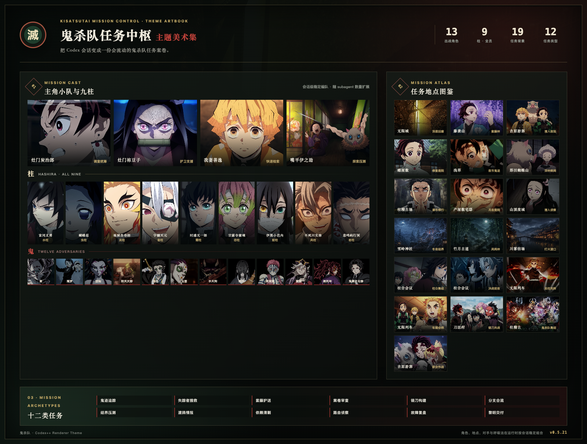
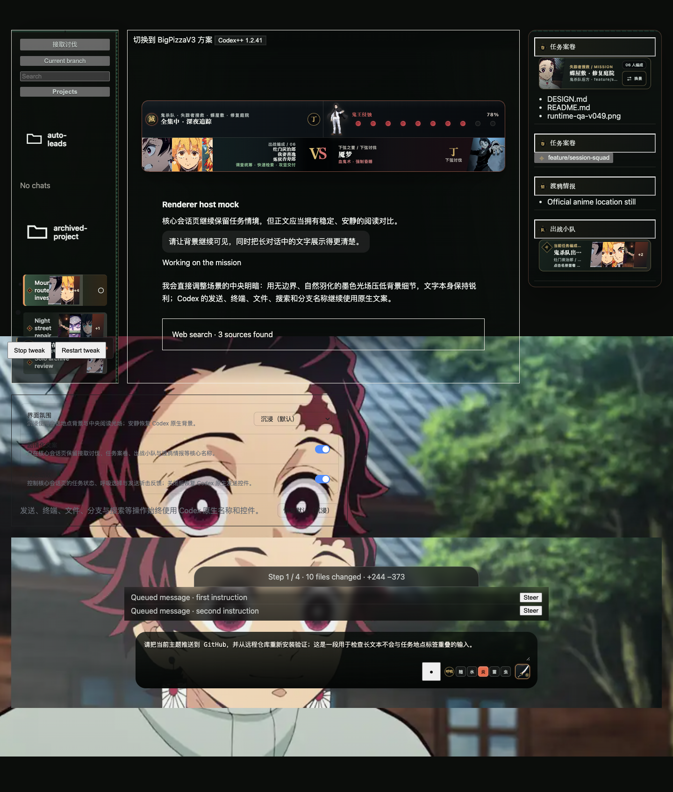
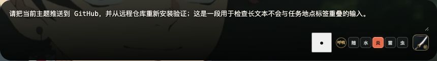
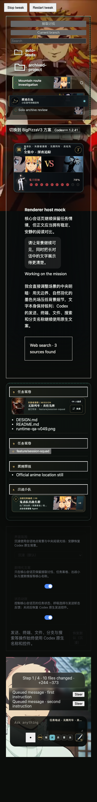

# 鬼灭之刃 Codex 主题 · 鬼杀队任务中枢

把 Codex 会话变成鬼杀队任务案卷：角色编队、任务地点、对手难度和呼吸法反馈会随当前会话稳定组合。适用于 Codex Desktop + [BigPizzaV3 Codex++](https://github.com/BigPizzaV3/CodexPlusPlus) `>= 1.2.41`，当前版本 `0.5.21`。

## 这个主题带来了什么

- 13 位出战角色：炭治郎、祢豆子、善逸、伊之助，以及完整九柱。
- 19 个任务背景：十二处地点场景之外，加入七张来自《鬼灭之刃》动画官网的现成人物横版素材——柱合会议、无限列车小队、炼狱、刀匠村共战、柱稽古集结与游郭主角团；新增素材以 WebP 进入离线背景池，不使用 AI 生成图冒充原作素材，也不靠模糊副本填满宽屏。
- 12 类任务叙事：从鬼迹追踪、案卷审查、锻刀构建，到分支合流、回归压测和黎明交付。
- 会话级稳定编队：subagent 增加时追加队员，同一会话的角色、地点和对手不会反复跳变；不喜欢当前背景时，可在任务案卷卡点击“换景”，选择只对当前会话生效并跨重启保留。
- 水、炎、雷、虫四种呼吸法，以及日轮刀发送与斩击反馈。
- 只装饰 Codex 会话页；设置页、确认框和图片查看器继续使用 Codex 原生样式。
- 整个任务窗口只绘制一张连续的当前地点图；左侧任务与会话、中央对话、Composer 和右侧案卷都只是同一场景上的半透明阅读层，不再各自裁切成四张独立背景，也不叠加低透明度队员或恶鬼。无惨小人物仅保留在尺寸固定、语义清晰的“鬼王侵蚀”指标中。
- 运行时图片统一为 WebP；新增官方群像按 `1024×576 / WebP q34` 独立压缩，完整素材与自包含用户脚本都由构建检查强制执行 `2 MiB` 上限。
- 图片变量只在进入任务页时初始化一次；DOM 观察器会隔离主题自身写入，并主动回收被 Codex 重渲染替换的按钮、监听器和短时动效。

## 实际效果

## 一句话交给 AI 安装

把下面这句话发给 Codex 或其他能操作终端的 AI：

> 请执行并检查 `curl -fsSL https://raw.githubusercontent.com/anson-no-bug/codex-themes-demon-slayer/main/install.sh | sh`；安装器会在缺少 BigPizzaV3 Codex++ 时自动识别 Mac 架构、下载并校验官方 DMG、安装双 App，再安装主题。完成后必须从 `/Applications/Codex++.app` 启动并验证主题。

需要自己操作时，直接看 [INSTALL.md](./INSTALL.md)。

官方 Codex 是唯一前置条件。安装器会自动补齐 BigPizzaV3 双 App，并只把主题写入 `~/.config/Codex++/user_scripts/`；下载的 DMG 必须匹配 GitHub Release API 提供的 SHA-256 才会安装。它不会修改官方 `app.asar`、不会重签名 Codex、不会创建官方 App 备份、不会安装 LaunchAgent，也不会创建本地签名证书。主题只在通过 `Codex++.app` 启动时加载；直接打开官方 Codex 保持原生界面。

本项目是非官方、非商业的本地粉丝主题；素材来源和使用边界见 [ATTRIBUTION.md](./ATTRIBUTION.md)。
